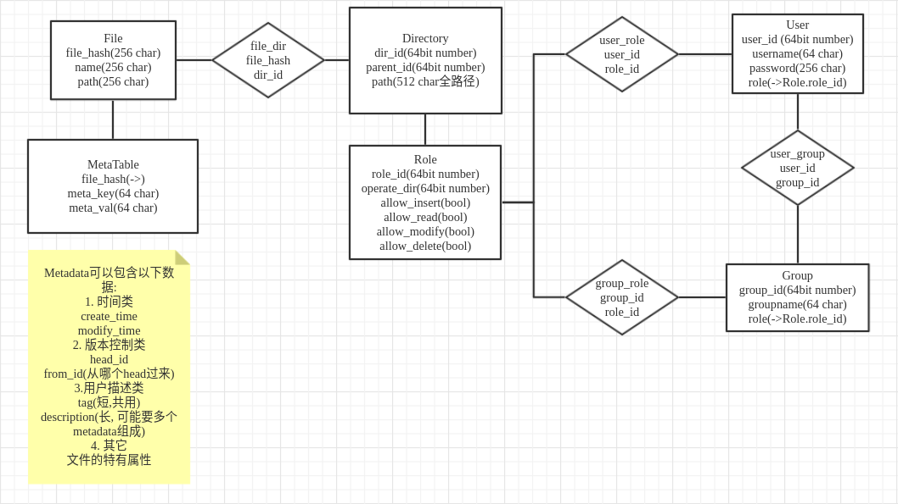

### backend 说明
backend文件结构:
```bash
.
├── api
│   ├── file.py
│   ├── __init__.py
│   └── manage.py
├── utils
│   ├── code.py
│   ├── __init__.py
│   └── logger.py
├── app.py
├── __init__.py
├── main.py
├── misc.py
└──  models.py
```
app是后端的http服务器的实现, 使用flask

main是启动服务器的函数, 实际应用中不会使用main文件来使用flask的默认服务器, 而是使用nginx+uwsgi, 这样可以达到很高的效率和并发量, 同时可以部署多个后端服务器做负载均衡处理

models是数据库ORM结构的定义, 我使用了python的SQLAlchemy库来实现跨数据库的表格结构定义而不用拘泥于一种或几种特定的数据库, 比使用模板+SQL语言的实现有更好的通用性和便利性

api文件夹下是app的每一个接口的实际实现, file包含了所有文件操作的实现, manage包含了所有用户管理操作的实现

utils文件夹下包含了一些基本的类定义和函数, code中定义了状态码, logger中实现了向文件输出的和向命令行输出的logger

以下是数据库的表的结构和互相之间的联系, ->表示外键引用, file_dir, user_role, user_group, group_role起到联系集的作用, 它们均为多对多
 